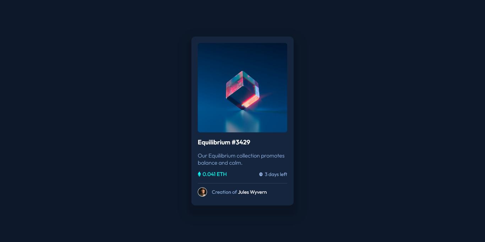

# Frontend Mentor - NFT preview card component solution

This is a solution to the [NFT preview card component challenge on Frontend Mentor](https://www.frontendmentor.io/challenges/nft-preview-card-component-SbdUL_w0U). Frontend Mentor challenges help you improve your coding skills by building realistic projects. 

## Table of contents

- [Overview](#overview)
  - [The challenge](#the-challenge)
  - [Screenshot](#screenshot)
  - [Links](#links)
- [My process](#my-process)
  - [Built with](#built-with)
  - [What I learned](#what-i-learned)
  - [Continued development](#continued-development)
  - [Useful resources](#useful-resources)
- [Author](#author)

## Overview

### The challenge

Users should be able to:

- View the optimal layout depending on their device's screen size
- See hover states for interactive elements

### Screenshot



### Links

- Solution URL: [Add solution URL here](https://your-solution-url.com)
- Live Site URL: [Add live site URL here](https://your-live-site-url.com)

## My process

### Built with

- Flexbox
- BEM Methodology
- CSS custom properties

### What I learned
In this challenge, I learned what BEM methodology is and used it. For my upcoming projects, I will continue to practice BEM and learn other methodologies along the way.  

```html
    <div class="card__info">
      <div class="card__info--left">
        
        <p class="card__info--left-price">
            0.041 ETH
        </p>
      </div>
```

Aside from BEM methodology, I learned how to use em and rem units. For me, these units are challenging. I'm not sure if I used it right on this project, but I will work on it on future projects.

```css
.card__info--right,
.card__info--left {
  display: flex;
  justify-content: center;
  align-items: center;
  column-gap: 0.25em;
}

.card__description {
  color: var(--color-primary);
  font-size: 0.975rem;
  font-weight: 300;
}
```

I also used CSS custom properties, which will be a great technique to use for bigger projects.
```css
:root {
  /* font color*/
  --color-primary: hsl(215, 51%, 70%);
  --color-primary-light: hsl(178, 100%, 50%);
```

### Continued development

In future projects I wanna focus on:
Responsive web design (Mobile-first workflow, Media Queries)
Typography (Em & Rem units)
CSS Flexbox & Grid
CSS Methodology (BEM)

### Useful resources

- [getbem.com](http://getbem.com/introduction/) - I used this as a guide in using BEM methodology.
- [Kevin Powell](https://www.youtube.com/kepowob) - I watched his videdo regarding CSS units. This is a great channel that focuses on CSS.

## Author

- Frontend Mentor - [@arey-dev](https://www.frontendmentor.io/profile/arey-dev)
